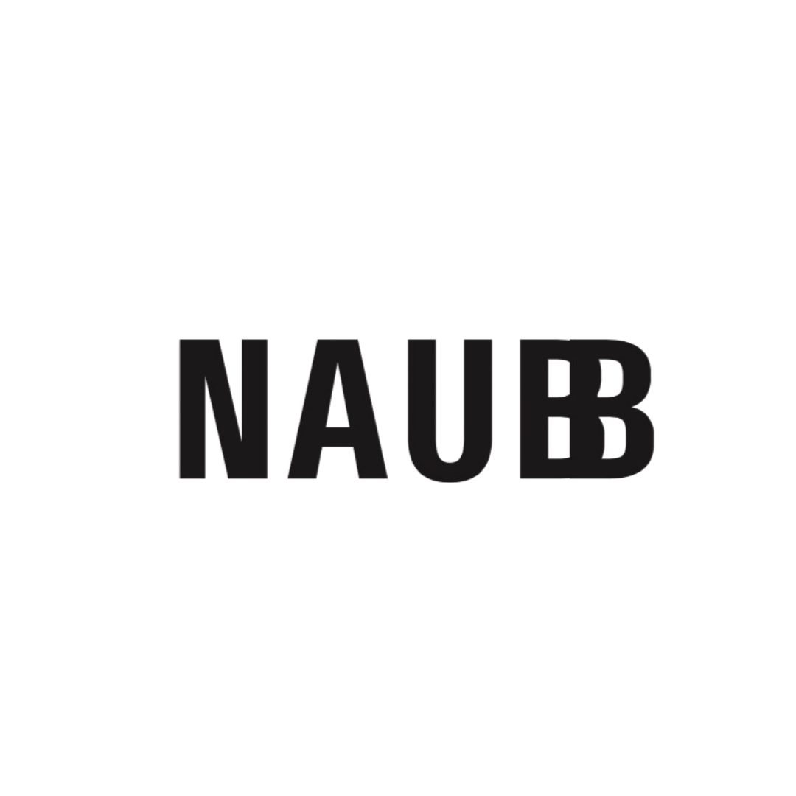

# NAUB — Documentazione completa del progetto

> Documento esaustivo, aggiornato allo stato attuale del file (`index.html`). Se qualcosa nel file live non corrisponde a quanto descritto qui, fidati del file live e segnala la discrepanza — questo documento è uno snapshot, non la fonte di verità.

---

## 1. Cos'è questo progetto

Sito web statico a **pagina singola** per **NAUB** ("Not An Usual Brand"), uno studio creativo con sede a **Melito di Napoli (NA)**. NAUB produce fotografia editoriale, direzione creativa, content per social e copertura eventi/live per brand di moda, lifestyle e musica.

**Founder & Creative Director**: Raffaele Di Matteo (proprietario del progetto, committente di questa conversazione).

### Origine e pivot importante
Il file `index.html` è nato da un template per **"VARCO Digital"**, un'agenzia di sviluppo software (Java/Spring Boot/React). Il committente ha fornito una cartella `assets/foto` piena di fotografia editoriale di moda/streetwear/eventi live, chiarendo che il business reale è **NAUB, uno studio creativo/fotografico**, non un'agenzia di sviluppo. È stato quindi eseguito un rebrand completo: contenuti, palette, tipografia e struttura delle sezioni sono stati riscritti da zero per il nuovo posizionamento. Non ci sono più tracce di "VARCO" nel file attuale.

### Lingua
Tutto il copy del sito è in **italiano**. Mantenere questa lingua per qualsiasi nuovo contenuto, salvo indicazione contraria del committente.

---

## 2. Struttura dei file

```
Sito Naub/
├── index.html              ← markup della pagina (HTML), collega css/styles.css e js/script.js
├── css/
│   └── styles.css           ← tutto il CSS del sito (ex blocco <style> inline)
├── js/
│   └── script.js             ← tutto il JavaScript del sito (ex blocco <script> inline a fine pagina)
├── PROGETTO-NAUB.md         ← questo documento
└── assets/
    ├── foto/                ← 17 foto editoriali (vedi sezione 7)
    ├── video/                ← 5 video (4 .MOV dal telefono + 1 .mp4 da Instagram, vedi sezione 8)
    └── logo/
        ├── naub/naub-logo.png ← logo NAUB (PNG, sfondo trasparente), usato nella sezione pinned (vedi sezione 5, punto 5)
        └── clienti/          ← 10 loghi brand clienti (PNG, sfondo trasparente), usati nella sezione #clienti (vedi sezione 5, punto 7)
```

Il sito è stato **separato in tre file** (HTML/CSS/JS) su richiesta esplicita del committente, dopo essere nato come singolo `index.html` autosufficiente con CSS e JS inline. Resta comunque **senza build/bundler/dipendenze npm** (solo Google Fonts via CDN): `index.html` collega `css/styles.css` con un `<link rel="stylesheet">` e `js/script.js` con un `<script src="...">` prima di `</body>`, con percorsi relativi. Si apre ancora direttamente in un browser via `file://` oppure si serve com'è da un qualunque hosting statico.

**Eccezione voluta**: lo script di bootstrap fail-safe `document.documentElement.classList.add('js-anim')` (vedi sezione 6.2) **resta inline nell'`<head>` di `index.html`**, non è stato spostato in `js/script.js`. Deve eseguire in modo sincrono prima che il resto della pagina sia renderizzato — spostarlo in un file esterno introdurrebbe un ritardo di rete che vanificherebbe lo scopo del fail-safe (il contenuto potrebbe apparire nascosto per un istante, o restare nascosto se il file esterno non carica). **Non spostarlo in `script.js` senza una richiesta esplicita.**

Il nome del file principale è stato scelto deliberatamente `index.html` (in origine era `varco-digital-template.html`) perché è la convenzione per la homepage di un sito statico.

**Nota percorsi**: la cartella di progetto si chiama `Sito Naub` (con spazio). I riferimenti interni nell'HTML sono tutti **relativi** (`assets/foto/IMG_xxxx.PNG`, `assets/video/...`), quindi lo spazio nel nome della cartella padre non causa problemi — i browser risolvono correttamente i percorsi relativi rispetto alla posizione del file HTML stesso.

---

## 3. Stack tecnico

- **HTML5** semantico, vanilla, nessun framework. Markup in `index.html`.
- **CSS**: tutto in `css/styles.css`, organizzato a **CSS custom properties** (design token in `:root`) + regole per componente, commentate a blocchi (`/* ---------- Nome sezione ---------- */`). Collegato via `<link rel="stylesheet" href="css/styles.css">` nell'`<head>`.
- **JavaScript**: tutto in `js/script.js`, IIFE `(function(){ "use strict"; ... })()`, **vanilla**, nessuna libreria esterna (niente jQuery, GSAP, ScrollTrigger, ecc. — tutte le animazioni sono scritte a mano con IntersectionObserver, CSS transitions/keyframes e un loop `scroll`/`requestAnimationFrame`-like manuale). Collegato via `<script src="js/script.js"></script>` subito prima di `</body>`, nella stessa posizione in cui prima stava il blocco inline. Fa eccezione il bootstrap `js-anim` (una riga), che resta inline nell'head — vedi sezione 2 e 6.2.
- **Font**: caricati da Google Fonts via `<link>` (vedi sezione 5).
- Nessun sistema di build, nessun `package.json`, nessun test. Le modifiche si fanno editando direttamente `index.html`, `css/styles.css` o `js/script.js` a seconda della parte da toccare.

---

## 4. Design system

### 4.1 Palette colori (custom properties in `:root`)

```css
--bg:#FFFFFF;              /* sfondo pagina — SEMPRE bianco, vedi nota sotto */
--surface:#FFFFFF;         /* sfondo card/superfici primarie */
--surface-2:#F5F2EC;       /* sfondo alternato (sezioni .alt, tag, icon-box) — beige caldo chiarissimo */
--ink:#16181C;             /* testo principale, quasi nero */
--muted:#6E7178;           /* testo secondario/grigio */
--accent:#AD5A2B;          /* colore di accento — terracotta/argilla, usato per CTA primarie, eyebrow, tag */
--accent-ink:#FFFFFF;      /* testo sopra --accent */
--accent-2:#16181C;        /* alias di --ink, usato in un paio di punti come "secondo" accento neutro */
--accent-2-ink:#FFFFFF;
--line:rgba(22,24,28,0.10);        /* bordi sottili */
--line-strong:rgba(22,24,28,0.18); /* bordi più marcati (hover) */
--shadow:0 24px 60px -30px rgba(22,24,28,0.28);
--radius:16px;              /* raggio standard di card/foto/bottoni block */
```

**Decisione esplicita e vincolante**: il sito **non ha modalità scura automatica**. In una versione precedente esisteva un blocco `@media (prefers-color-scheme: dark)` che scuriva il sito se il sistema operativo del visitatore era in dark mode — è stato **rimosso deliberatamente** perché il committente ha richiesto esplicitamente "sfondo bianco, punto", indipendentemente dal tema di sistema. **Non reintrodurre la dark mode automatica senza che il committente la richieda di nuovo.** C'è un commento nel CSS che lo ricorda:
```css
/* Il sito resta sempre chiaro: nessuna modalità scura automatica, a prescindere dal tema di sistema del visitatore. */
```

### 4.2 Tipografia — 4 famiglie, ciascuna con un ruolo preciso

```css
--sans:'Inter', system-ui, -apple-system, "Segoe UI", sans-serif;        /* corpo del testo */
--display:'Fraunces', Georgia, serif;                                     /* identità di marca (vedi sotto) */
--heading:'Archivo', system-ui, -apple-system, "Segoe UI", sans-serif;    /* titoli di sezione h1/h2/h3 */
--mono:'IBM Plex Mono', ui-monospace, SFMono-Regular, Menlo, monospace;   /* eyebrow, tag, bottoni, label */
```

Caricamento Google Fonts (unico `<link rel="stylesheet">`):
```
Fraunces:opsz,wght@9..144,400;9..144,500;9..144,600;9..144,700;9..144,900
Archivo:wght@700;800;900
Inter:wght@400;500;600
IBM+Plex+Mono:wght@500;600
```

**Chi usa cosa (importante, è stato iterato più volte dal committente)**:
- `h1, h2, h3` → **Archivo, peso 800 (ExtraBold), sempre maiuscolo** (`text-transform:uppercase`), `letter-spacing:0`. Questa è l'ultima richiesta esplicita del committente (font cambiato da Fraunces → Roboto → Archivo, poi reso bold+maiuscolo). **Non cambiare questo font senza una richiesta esplicita**, è stato deciso dopo diverse iterazioni.
- `.brand-word` (logo testuale "NAUB" in header/footer), `.proj-title` (titoli portfolio), `.team-photo-name` (nomi team), `.mobile-sheet a` → restano in **Fraunces** (serif), per mantenere un tocco editoriale/fashion distinto dai titoli di sezione. Questa distinzione è voluta: Archivo per la struttura/gerarchia dei titoli, Fraunces per gli elementi di identità di marca. (La sezione pinned non usa più testo per il logo: vedi punto 8 nella sezione 5 e sezione 6.5 — ora è un'immagine, `assets/logo/naub-logo.png`.)
- `.eyebrow`, `.btn`, tag, dt/label → **IBM Plex Mono**, maiuscolo, letter-spacing largo (stile "kicker" editoriale).
- Corpo testo, paragrafi, form → **Inter**.

### 4.3 Altri token di sistema
- `.section{padding-block:100px;}` — spaziatura verticale standard tra sezioni (64px su mobile ≤860px).
- `.wrap{max-width:1180px;margin-inline:auto;padding-inline:24px;}` — contenitore centrato standard.
- Raggio standard `16px` su card/foto/bottoni pill (`border-radius:999px` sui bottoni).
- Ombra standard `--shadow` per hover di card e bottoni primari.

---

## 5. Struttura della pagina (ordine reale delle sezioni)

**Nota**: l'ordine delle sezioni è stato riorganizzato più volte su richiesta esplicita del committente rispetto alle versioni precedenti di questo documento — quanto segue è l'ordine reale attuale, verificato sul file live.

1. **`<header>`** — sticky, blur di sfondo. Logo "NAUB" + tagline "Not An Usual Brand" sotto (lockup a due righe, `.brand-lockup`). Nav testuale (Home/Studio/Servizi/Lavori/Team/Contatti) + 2 bottoni CTA (`Scrivici` mailto, `Parliamo del progetto` → `#contatti`) con **tilt magnetico 3D** al passaggio del mouse (`data-tilt`). Su mobile (≤860px) i due bottoni CTA sono nascosti, resta solo l'hamburger — il CTA principale è comunque raggiungibile dal menu a tendina.
2. **`.mobile-sheet`** — menu mobile fullscreen, nascosto di default, si apre con `#navToggle`.
3. **`<section class="hero">`** — **video di sfondo a piena larghezza** (vedi sezione 8), testo bianco sovrapposto con gradiente scuro (`.hero-scrim`) per leggibilità, entrata testo a cascata via CSS `@keyframes fadeUp` (non scroll-triggered, parte da sola al caricamento). Il blocco `hero-stats` (Sede/Ambiti/Risposta) è stato rimosso su richiesta del committente.
4. **`.marquee-wrap`** — striscia orizzontale infinita con gli ambiti di NAUB (Fotografia Editoriale · Direzione Creativa · Content & Social · Eventi & Live · Moda · Musica · Lifestyle · Retail), sfondo nero, testo e diamantino (◆) bianchi, pausa al hover.
5. **`.pin-wrap` / `.pin-stage`** — **sezione "pinned" con scroll-scrub** (vedi sezione 6.5): 3 foto che entrano in sequenza + logo NAUB (`assets/logo/naub/naub-logo.png`, PNG a sfondo trasparente) in `mix-blend-mode:difference` (con `filter:invert(1)` per ottenere lo stesso effetto negativo che aveva il testo) che attraversa lo schermo mentre si scorre. In precedenza qui c'era la scritta gigante "NOT AN / USUAL BRAND" in Fraunces — sostituita col logo su richiesta esplicita del committente. Sostituisce quello che in una versione ancora precedente era un semplice banner full-bleed statico. Spostata subito dopo il marquee (in precedenza era più in basso, dopo Servizi).
6. **`#studio`** — "Perché NAUB" / "Non il solito contenuto." + griglia di 4 card (Occhio editoriale, Un solo interlocutore, Radicati nel territorio, Dal concept alla consegna). **Sfondo nero** (`var(--ink)`), eyebrow/titolo/paragrafo bianchi, card bianche invariate. Markup: `<section class="section"><div class="wrap">...</div></section>` (wrap interno, non sulla section stessa) così lo sfondo nero copre l'intera larghezza dello schermo.
7. **`#clienti`** — **nuova sezione "I nostri clienti."** (sfondo beige `.alt`), striscia marquee infinita con i loghi di 10 brand clienti (RHUN, Unique Dress, Island Coco, Matinée, Deliberti, Sorbino, Les (Art)ists, Empty Studios, Rubino Kids Boutique, Alcott — file in `assets/logo/clienti/`, PNG a sfondo trasparente forniti dal committente). Loghi in scala di grigi/opacità ridotta (`filter:grayscale(1) opacity(.75)`), colore pieno al hover, stesso pattern di scroll infinito del marquee servizi (`@keyframes marquee-scroll`, contenuto duplicato 2×).
8. **Backstage band** (sezione senza id, subito dopo Clienti) — layout `.split` testo+foto (`IMG_4186.PNG`), "Il backstage fa parte del racconto." **Non ha più `padding-top:0`** (rimosso — in precedenza restava incollata alla sezione sopra senza spaziatura).
9. **`#servizi`** — **sfondo nero** (`var(--ink)`), eyebrow e titolo bianchi, griglia di 4 card servizi (Fotografia Editoriale & Campagne, Direzione Creativa, Content & Social, Eventi & Live Coverage) — le card restano bianche.
10. **`#lavori`** — griglia portfolio di **6 progetti dimostrativi** (vedi sezione 7.2), click apre un pannello laterale di dettaglio (`.overlay`).
11. **`#team`** — **sfondo nero**, eyebrow/titolo/nota bianchi. 3 card **solo-foto** (vedi sezione 6.6), hover rivela nome+ruolo con sfumatura nera.
12. **`#contatti`** — ristrutturata: un blocco `.section-head` a piena larghezza in cima (eyebrow "Contatti", titolo, paragrafo — stesso pattern usato dalle altre sezioni), poi sotto una `.contact-grid` a due colonne (lista contatti a sinistra, form a destra). Il collasso a singola colonna avviene sotto i 640px (non più 860px), così i tablet mantengono le due colonne affiancate. Il form (`.form-card`) ha `max-width:420px` centrato nella sua colonna. Tutto allineato a sinistra, coerente col resto del sito (non centrato).
13. **`.overlay`** — pannello di dettaglio portfolio (slide-in da destra), popolato via JS dall'oggetto `projects` (vedi sezione 6.7).
13. **`<footer>`** — logo, tagline, link di sito, contatti, copyright con anno dinamico.

---

## 6. Sistema di animazioni (importante — è stato riscritto una volta da zero su richiesta esplicita)

### 6.1 Storia: perché il sistema è fatto così
Il sito ha avuto **due generazioni di animazioni**:
1. Una prima versione con parallax continuo su scroll, effetto "tendina" (`clip-path`) e blur/zoom sulle foto principali.
2. Il committente ha mandato un file HTML di riferimento (`animazioni-swag.html`, non più nel progetto, era solo un allegato di chat) con uno stile "SWAG": hero con testo a cascata via keyframes, sezione pinned con card+testo in blend-mode che scorre, card che si rivelano con stagger via `setTimeout`, marquee infinito, tilt magnetico sui pulsanti nav. **Il committente ha chiesto di sostituire TUTTE le animazioni del sito con quelle di quel riferimento.** Il sistema attuale è il risultato di quella riscrittura, adattato ai contenuti reali di NAUB. Non tornare al sistema precedente (parallax/curtain/blur) senza una richiesta esplicita.

### 6.2 Bootstrap "fail-safe" — non rimuoverlo
Prima riga eseguibile della pagina, nel `<head>`:
```html
<script>document.documentElement.classList.add('js-anim');</script>
```
Questo aggiunge la classe `js-anim` a `<html>` **sincronamente, prima che il resto della pagina venga renderizzato**. Tutte le regole CSS che nascondono elementi in attesa dell'animazione sono scritte come `html.js-anim .xxx{opacity:0; ...}` **mai** come `.xxx{opacity:0}` da sola.

**Perché è critico**: in una versione precedente il CSS nascondeva gli elementi (`opacity:0`) incondizionatamente, e se per qualunque motivo lo script che aggiungeva la classe "rivelata" falliva, il contenuto (comprese le foto) **spariva per sempre** — è successo davvero durante lo sviluppo e il committente si è lamentato ("non vedo tantissime foto e le transizioni non ci sono"). La soluzione: senza `js-anim` su `<html>`, **tutto il contenuto è visibile di default**, nessun elemento parte da `opacity:0`. Solo se il bootstrap riesce (praticamente sempre, a meno che JS sia disabilitato) il CSS "armato" sotto `html.js-anim` entra in gioco e gestisce le animazioni. **Non spostare questo script altrove nel documento e non rimuovere il prefisso `html.js-anim` da nessuna regola di occultamento.**

### 6.3 Entrata hero — keyframes CSS puri, non scroll-triggered
```css
@keyframes fadeUp{from{opacity:0;transform:translateY(26px);}to{opacity:1;transform:translateY(0);}}
html.js-anim .kf{opacity:0;}
html.js-anim .kf.k1{animation:fadeUp .8s .1s cubic-bezier(.16,1,.3,1) forwards;}
html.js-anim .kf.k2{animation:fadeUp .9s .26s ... forwards;}
html.js-anim .kf.k3{animation:fadeUp .85s .42s ... forwards;}
html.js-anim .kf.k4{animation:fadeUp .8s .58s ... forwards;}
html.js-anim .kf.k5{animation:fadeUp .9s .5s ... forwards;}
```
Ogni elemento dell'hero ha classe `kf` + un modificatore `k1`...`k5` che ne determina il ritardo, creando l'effetto a cascata (eyebrow → h1 → sottotitolo → CTA/stats). Parte al caricamento della pagina, **non** è legata allo scroll o a un IntersectionObserver.

### 6.4 Reveal on scroll + stagger delle griglie (JS, in `<script>` a fine pagina)
```js
var revealEls = document.querySelectorAll('.reveal, .grid-4, .portfolio-grid, .team-grid');
function revealTarget(target){
  if (target.matches('.grid-4, .portfolio-grid, .team-grid')){
    Array.prototype.forEach.call(target.children, function(child, idx){
      setTimeout(function(){ child.classList.add('in'); }, idx * 90);
    });
  } else {
    target.classList.add('in');
  }
}
// IntersectionObserver con threshold 0.15, unobserve dopo il trigger
```
- Blocchi singoli con classe `.reveal` (titoli di sezione, testo backstage, blocchi contatti) → fade-up semplice quando entrano nel viewport.
- Contenitori griglia (`.grid-4`, `.portfolio-grid`, `.team-grid`) → quando il contenitore entra nel viewport, **ogni figlio diretto** riceve la classe `.in` con un ritardo di `indice × 90ms` via `setTimeout` (non `transition-delay` CSS — scelta deliberata per fedeltà al riferimento del committente). Risultato: le card "salgono" una dopo l'altra invece che tutte insieme.
- **Nota tecnica di specificità CSS**: le regole di stato "rivelato" sono scritte come `.card.in`, `.proj-card.in`, `.team-photo-card.in` (classe sull'elemento stesso, non `.grid-4.in .card`) proprio per avere la stessa specificità di `.card:hover` e permettere all'hover di vincere sempre sul transform di rivelazione. Se si tocca questo sistema, mantenere questo pattern o l'hover-lift delle card smette di funzionare silenziosamente.

### 6.5 Sezione "pinned" con scroll-scrub (`.pin-wrap` / `.pin-stage`)
Il pezzo più complesso del sito. Markup:
```html
<div class="pin-wrap" id="pinWrap">       <!-- altezza 250vh (190vh sotto 700px) -->
  <div class="pin-stage">                  <!-- position:sticky; top:0; height:100vh -->
    <p class="pin-caption">...</p>
    <div class="pin-card c1">...</div>     <!-- 3 card fotografiche posizionate assolutamente -->
    <div class="pin-card c2">...</div>
    <div class="pin-card c3">...</div>
    <div class="blend-text" id="blendText"></div>
    <p class="pin-cta">...</p>
  </div>
</div>
```
JS (`onPinScroll`, richiamato su `scroll` e `resize`, eseguito anche una volta al caricamento):
```js
var rect = pinWrap.getBoundingClientRect();
var total = rect.height - window.innerHeight;
var progress = clamp(-rect.top / total, 0, 1);   // 0 → 1 mentre si scorre attraverso i 250vh

pinCards.forEach(function(card, i){
  var delay = i * 0.12;
  var p = clamp((progress - delay) / 0.35, 0, 1);
  var eased = 1 - Math.pow(1 - p, 3);              // ease-out cubico
  card.style.opacity = eased;
  card.style.transform = 'translateY(' + ((1 - eased) * 70) + 'px)';
});

var offset = (0.5 - progress) * 120;               // 120 = "vh totali percorsi" dal testo
blendText.style.transform = 'translateY(' + offset + 'vh)';
```
Effetto: mentre l'utente scorre attraverso questa sezione (alta 250vh), lo stage resta "agganciato" a schermo intero; le 3 foto compaiono in sequenza salendo e sfumando, mentre il logo NAUB (immagine, non più testo — vedi sotto) attraversa verticalmente lo schermo in `mix-blend-mode:difference` (che lo rende bianco/nero/invertito a seconda di cosa ha sotto — foto o sfondo bianco della pagina). **Se si modifica il contenuto delle 3 `.pin-card`, mantenere 3 elementi** — il calcolo del `delay` (`i * 0.12`) presuppone esattamente 3 card.

**Logo al posto del testo (cambiato su richiesta esplicita)**: in origine `.blend-text` conteneva testo ("NOT AN" / "USUAL BRAND" in Fraunces). È stato sostituito con `` (PNG 1080×1080, sfondo trasparente, glifi neri, fornito dal committente). Poiché `mix-blend-mode:difference` da solo non produce l'effetto voluto su un'immagine con inchiostro nero (nero in difference-blend lascia il colore sottostante invariato, quindi il logo sparirebbe), è stato aggiunto `filter:invert(1)` sull'`` per convertire i glifi neri in bianchi prima del blend — replicando esattamente il comportamento che il testo bianco aveva in origine. Il logo è dimensionato con `width:clamp(200px,30vw,460px)` e `height:auto`; il PNG ha molto padding trasparente sopra/sotto ai glifi, quindi il riquadro dell'immagine è più alto del testo visibile, ma non causa problemi essendo trasparente.

Le foto usate qui (`IMG_4170.PNG`, `IMG_4180.PNG`, `IMG_4167.PNG`) sono **duplicate** rispetto al portfolio sottostante (stesse foto riusate anche come card del portfolio) — scelta consapevole di "teaser + galleria completa", non un errore.

### 6.6 Team — card solo-foto con reveal on hover
Su richiesta esplicita: "la card deve essere solo foto, quando ci si passa sopra con il cursore escono le scritte con una lieve sfumatura nera dietro il testo". Implementato con `.team-photo-card` (`aspect-ratio:3/4`, `overflow:hidden`) contenente o un'immagine reale (`img`) o — attualmente, per tutti e 3 — un **placeholder** `.team-photo-placeholder` (iniziali su sfondo sfumato ink→accent, es. "RD", "GD", "SMM"), più un `.team-photo-overlay` con gradiente nero dal basso che appare in opacità su `:hover` e `:focus-visible`, rivelando `.team-photo-role` + `.team-photo-name` con un piccolo `translateY`. Accessibile da tastiera (`tabindex="0"` + `:focus-visible`).

**Nessuna foto reale disponibile per il team**: nessuna delle 17 foto in `assets/foto` è un ritratto adatto a rappresentare in modo veritiero Founder/Graphic Designer/Social Media Manager (sono tutte fotografia di moda/campagna con modelli terzi) — usare una di quelle foto per un membro del team sarebbe fuorviante. **Se il committente fornisce foto reali, sostituire `.team-photo-placeholder` con un `` dentro `.team-photo-card`, seguendo lo stesso pattern già usato per `.proj-thumb img`.**

### 6.7 Overlay dettaglio portfolio
Click su una `.proj-card[data-project]` → `openProject(key)` legge l'oggetto JS `projects` (6 chiavi: `streetwear1`, `streetwear2`, `ritratto`, `retail`, `product`, `live`), popola il pannello `.overlay` (immagine, tag, titolo, **Obiettivo / Approccio / Output**) e apre uno slide-in da destra. Aggiorna l'URL con `history.pushState` (`#progetto-<key>`) e lo ripristina a `#lavori` alla chiusura. Chiusura via bottone X, click fuori dal pannello, o `Escape`. Gestisce il focus (torna all'elemento che aveva aperto l'overlay alla chiusura, per accessibilità da tastiera).

### 6.8 Tilt magnetico 3D (nav)
Solo sui 2 bottoni dell'header con `data-tilt` (non sulle card, non sul resto del sito — scelta deliberata per fedeltà al riferimento "SWAG" fornito dal committente, dove solo i "pills" della nav avevano questo effetto). Formula:
```js
var rotY = (x / r.width) * 26;
var rotX = -(y / r.height) * 26;
el.style.transform = 'perspective(300px) rotateX(' + rotX + 'deg) rotateY(' + rotY + 'deg) scale(1.06)';
```
Attivo solo se `window.matchMedia('(hover: hover) and (pointer: fine)').matches` (esclude touch) e `!reduceMotionCheck()`.

### 6.9 Marquee
Puro CSS: `.marquee` contiene la lista di 8 voci **duplicata due volte** (16 `<span>` totali) per ottenere un loop senza scatti con `@keyframes marquee-scroll{ to{transform:translateX(-50%);} }`, `animation-play-state:paused` su `:hover`.

### 6.10 Rispetto di `prefers-reduced-motion`
C'è un blocco `@media (prefers-reduced-motion: reduce)` dedicato che: disattiva keyframes hero, disattiva reveal/transform delle card (mostra tutto già "in"), disattiva il marquee, forza l'overlay team sempre visibile (non solo su hover, per non nascondere informazioni dietro un'interazione che l'utente potrebbe non voler fare). In JS, `reduceMotionCheck()` viene controllato prima di: avviare il video hero in autoplay, applicare il tilt nav, calcolare lo scroll-scrub del pin-stage. **Mantenere questi controlli in qualsiasi nuova animazione aggiunta.**

---

## 7. Foto (`assets/foto/`) — mappa completa di utilizzo

17 file totali, tutti `.PNG` (maiuscolo, così sul filesystem — case-insensitive su Windows ma i riferimenti nell'HTML rispettano l'estensione maiuscola per sicurezza se mai il sito finisse su hosting case-sensitive tipo Linux).

### 7.1 Decisione sul contenuto sensibile (importante, presa col committente)
Le foto sono editoriali di moda/streetwear/eventi. Alcune (bikini/lingerie, editoriali piuttosto sensuali) sono state **esplicitamente escluse dal sito** su scelta del committente, che ha risposto "Solo le più pulite in evidenza" a una domanda diretta su come trattarle. Queste foto **non vanno inserite nel sito pubblico senza una nuova richiesta esplicita**:

`IMG_4171.PNG`, `IMG_4172.PNG`, `IMG_4173.PNG`, `IMG_4174.PNG`, `IMG_4175.PNG`, `IMG_4176.PNG`, `IMG_4183.PNG`, `IMG_4184.PNG`

### 7.2 Foto attualmente usate nel sito (8 file, alcuni riusati in 2 punti)

| File | Dove | Note |
|---|---|---|
| `IMG_4185.PNG` | `poster` del video hero (`<video poster="...">`) | Era la foto hero prima di passare al video di sfondo; ora è solo il fotogramma di fallback mostrato prima che il video carichi/parta. |
| `IMG_4186.PNG` | Sezione "Backstage band" (`#bandPhoto`) | Foto behind-the-scenes di uno shooting. |
| `IMG_4170.PNG` | Pin-stage card `c1` **+** portfolio "Ritratto Editoriale" | Riuso intenzionale (teaser + galleria). |
| `IMG_4180.PNG` | Pin-stage card `c2` **+** portfolio "Streetwear Capsule — Look 01" | Riuso intenzionale. |
| `IMG_4167.PNG` | Pin-stage card `c3` **+** portfolio "Live & Music Coverage" | Riuso intenzionale. |
| `IMG_4182.PNG` | Portfolio "Streetwear Capsule — Look 02" | |
| `IMG_4178.PNG` | Portfolio "Apertura Concept Store" (foto di una vetrina retail) | |
| `IMG_4179.PNG` | Portfolio "Product Still Life" (sneaker) | |

### 7.3 Foto NON usate attualmente (ma "pulite", riutilizzabili)

- `IMG_4168.PNG` — **era** l'immagine del vecchio banner manifesto full-bleed (sezione poi sostituita dal pin-stage animato, vedi 6.4/sezione 5 punto 8). Attualmente **non referenziata da nessuna parte del file**. È una foto pulita (streetwear + auto d'epoca), buona candidata se serve un'altra foto in futuro.

Tutte le altre foto "pulite" (`IMG_4185`, `4186`, `4170`, `4180`, `4167`, `4182`, `4178`, `4179`) sono già in uso come da tabella sopra — cioè **tutte le 9 foto ritenute idonee sono state impiegate almeno una volta** (contando anche la 4168 ora orfana, sono 9 in totale idonee, 8 attualmente in uso).

---

## 8. Video (`assets/video/`)

| File | Dimensione | Stato |
|---|---|---|
| `SnapInsta.to_AQN821u0dPLusfpoUvR_ekZBNxcv4VV0nWslQ0wE0IdeZ3FR8W7bmDyeiiD5zjU_RpQOsdgRESiE6HxEbvLDfv0o.mp4` | 6,15 MB | **In uso** come sfondo della hero (vedi sotto). Scaricato da Instagram (SnapInsta), già in `.mp4`, compatibile con tutti i browser senza conversione. |
| `IMG_4080.MOV` | 21,8 MB | Non usato. |
| `IMG_4081.MOV` | 17,29 MB | Non usato. |
| `IMG_4082.MOV` | 23,84 MB | Non usato. |
| `IMG_4104.MOV` | 19,61 MB | Non usato. |

**Nota tecnica sui `.MOV`**: sono file QuickTime dal telefono, con supporto browser incoerente fuori da Safari/iOS — se in futuro si vuole usarne uno, **vanno prima convertiti in `.mp4` (H.264/AAC) e idealmente anche `.webm`** per compatibilità cross-browser affidabile. Non sono mai stati aperti/ispezionati in questa conversazione (nessun tool disponibile per leggere video), quindi orientamento/contenuto esatto non sono noti.

### 8.1 Implementazione video hero
```html
<section class="hero">
  <video class="hero-video" id="heroVideo" muted loop playsinline preload="auto"
         poster="assets/foto/IMG_4185.PNG" aria-hidden="true">
    <source src="assets/video/SnapInsta.to_....mp4" type="video/mp4">
  </video>
  <div class="hero-scrim"></div>
  <div class="hero-copy wrap"> ... testo hero, ora bianco ... </div>
</section>
```
- `.hero-video` è `position:absolute;inset:0;object-fit:cover;` dentro `.hero` (che è `position:relative;overflow:hidden;min-height:min(88vh,780px)`).
- `.hero-scrim` è un gradiente scuro (`linear-gradient(180deg, rgba(10,9,8,.15) 0%, rgba(10,9,8,.35) 45%, rgba(10,9,8,.82) 100%)`) sopra il video per garantire leggibilità del testo bianco, più scuro verso il basso dove sta il testo (`.hero{align-items:flex-end}`).
- **Autoplay gestito via JS, non via attributo HTML `autoplay`**, proprio per poter rispettare `prefers-reduced-motion`:
  ```js
  var heroVideo = document.getElementById('heroVideo');
  if (heroVideo && !reduceMotionCheck()){ heroVideo.play().catch(function(){}); }
  ```
  Se l'utente preferisce meno movimento, il video resta fermo sul `poster` (IMG_4185.PNG).
- Il video è `muted` (obbligatorio per l'autoplay in tutti i browser moderni) e `loop`.
- **Testo hero ora bianco** (`.hero-copy{color:#fff}`, `.hero-sub{color:rgba(255,255,255,.82)}`, `.hero .btn-ghost` ha bordo/testo bianco invece che scuro) — prima che ci fosse il video, l'hero era un layout a 2 colonne (testo scuro a sinistra + card fotografica a destra su sfondo bianco). Quella card fotografica statica **non esiste più** nell'hero: è stata rimossa, il video ne prende il posto come sfondo.

---

## 9. Contenuti/copy — dati "veri" vs placeholder

| Dato | Valore attuale | Stato |
|---|---|---|
| Email | `info@naub.it` | **Placeholder non verificato** — non è certo che il dominio `naub.it` sia registrato. Da sostituire con l'email reale. |
| Telefono | `+39 000 000 0000` | **Placeholder esplicito**, era già un placeholder nel template originale VARCO, mai sostituito. |
| Sede | Melito di Napoli (NA) | Presumibilmente reale (ereditato dal contesto originale). |
| Orari | Lun–Ven, 9:00–18:00 | Placeholder plausibile, non confermato dal committente. |
| Founder | Raffaele Di Matteo | Nome reale del committente, confermato dall'email di sessione (`raffaeledimatteo2001@gmail.com`) e dal contesto. |
| Graphic Designer / Social Media Manager | Posizioni aperte, nessun nome | Vedi sezione 6.6 — card placeholder, in attesa di assunzioni reali. |
| Tutti i "progetti" in `#lavori` | Etichettati `Format dimostrativo` nel tag | **Sono case study fittizi/dimostrativi**, non progetti reali per clienti veri — il copy lo dichiara esplicitamente ("Questi sono format dimostrativi: il prossimo caso studio può essere il tuo."). Se in futuro arrivano progetti reali, questo va aggiornato e la dicitura "Format dimostrativo" va tolta caso per caso. |

---

## 10. Accessibilità implementata

- Tutte le animazioni rispettano `prefers-reduced-motion` (vedi 6.10).
- `.team-photo-card` ha `tabindex="0"` + `aria-label` descrittivo, e l'overlay informativo si apre anche su `:focus-visible`, non solo `:hover`.
- L'overlay portfolio gestisce il focus (lo sposta sul bottone di chiusura all'apertura, lo restituisce all'elemento che ha aperto l'overlay alla chiusura) e si chiude con `Escape`.
- Bottoni `:focus-visible` hanno outline visibile (`outline:2px solid var(--accent)`).
- Video hero ha `aria-hidden="true"` (è puramente decorativo, il contenuto informativo è nel testo sovrapposto, non nel video).
- Alt text descrittivi in italiano su tutte le immagini content (non generici tipo "immagine").

---

## 11. Responsive — breakpoint usati

- `@media (max-width:860px)`: nav diventa hamburger, griglie a 4 colonne → 2, hero più basso.
- `@media (max-width:700px)`: ridimensiona pin-stage (altezza wrapper 190vh invece di 250vh, card più piccole).
- `@media (max-width:640px)`: team-grid 3 colonne → 2.
- `@media (max-width:560px)`: griglie → 1 colonna, hero-stats impilate, h2 più piccolo, overlay portfolio a piena larghezza.

Nessun breakpoint per tablet-landscape specifico oltre questi quattro.

---

## 12. Cose aperte / prossimi passi plausibili

1. **Email e telefono placeholder** da sostituire con dati reali (sezione 9).
2. **Foto reali per il team** (Founder, Graphic Designer, Social Media Manager) da sostituire ai placeholder a iniziali (sezione 6.6).
3. **Video `.MOV` non convertiti**: se servono altri video sul sito, vanno prima convertiti in `.mp4`/`.webm`.
4. **`IMG_4168.PNG` orfana**: foto pulita non più referenziata da nessuna parte (sezione 7.3), disponibile per riuso.
5. **8 foto escluse per contenuto sensibile** (sezione 7.1): non reinserirle senza una richiesta esplicita del committente — è stata una decisione deliberata, non una svista.
6. **Pubblicazione online**: in una fase precedente della conversazione si è preparata (ma **non completata**, il committente ha detto "fermati" a metà) una versione del file adattata per la pubblicazione come Artifact/anteprima condivisibile (rimozione dei tag `<!DOCTYPE>/<html>/<head>/<body>` che l'Artifact tool fornisce automaticamente nel proprio skeleton). Quel file temporaneo era in una cartella di scratchpad di sessione e **probabilmente non esiste più** (scratchpad non persistente tra sessioni). Se serve un link condivisibile del sito, va rifatto da capo: il sito **non è hosted da nessuna parte**, esiste solo come file locale `index.html`. Non esiste un dominio `naub.it` reale né un hosting configurato, a quanto risulta da questa conversazione.
7. **Progetti portfolio fittizi**: tutti e 6 i "lavori" mostrati sono format dimostrativi con foto reali ma narrazione/cliente inventati per lo scopo dimostrativo — chiarirlo con il committente se devono restare così o essere sostituiti da case study reali.

---

## 13. Vincoli espliciti da rispettare (riassunto delle richieste dirette del committente)

- **Sfondo sempre bianco**, nessuna dark mode automatica.
- **Titoli (h1/h2/h3): Archivo ExtraBold 800, tutto maiuscolo**, dimensioni generose (hero fino a ~4.6rem, h2 fino a ~3.6rem).
- Le animazioni del sito devono rispecchiare lo stile del riferimento "SWAG" fornito dal committente (hero a cascata via keyframes, sezione pinned con blend-text scroll-scrub, reveal a stagger via `setTimeout`, marquee infinito, tilt magnetico solo sui pulsanti nav) — **non reintrodurre il vecchio sistema curtain/blur/parallax continuo**.
- Team: card **solo foto**, info (nome/ruolo) rivelate **solo al hover**, con sfumatura nera dietro il testo.
- Nessuna foto/contenuto "sensuale" (bikini/intimo) in evidenza sul sito pubblico.
- Contenuto e UI in italiano.
